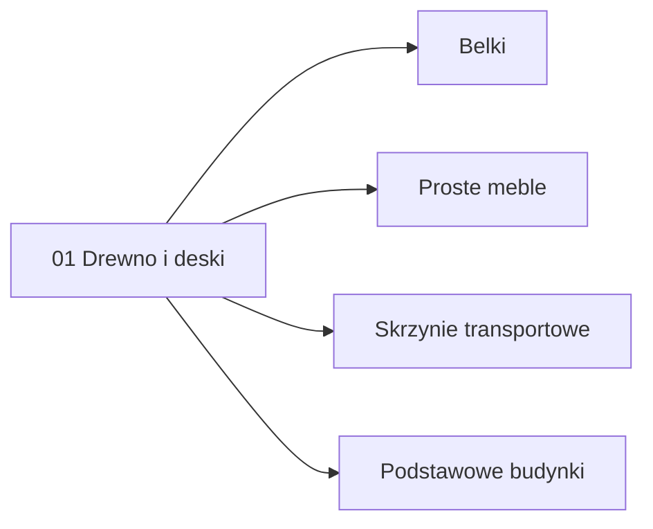

# Łańcuchy Produkcji

Ten dokument jest indeksem production chains, czyli ścieżek od surowca do
produktu, budynku, ulepszenia albo towaru handlowego.

Na początku projekt może mocno inspirować się Anno: proste surowce prowadzą do
coraz bardziej wyspecjalizowanych budynków, a gracz uczy się optymalizować
przepływ materiałów, czas produkcji i zależności między specjalizacjami.

## Struktura

Konkretne łańcuchy produkcji są trzymane w katalogu:

[production-chains](production-chains)

Pliki w katalogu powinny być numerowane według kolejności projektowania albo
odblokowywania w grze.

Przykład:

- `00-template.md` - szablon dla nowych chainów,
- `01-drewno-i-deski.md` - pierwszy chain startowy,
- `02-kamien-i-cegly.md` - potencjalny kolejny chain,
- `03-ruda-i-sztabki.md` - potencjalny kolejny chain.

## Założenia Dla Chainów

Każdy chain powinien być projektowany jak mała gospodarka.

Dobry chain odpowiada na pytania:

- jaki surowiec startowy uruchamia produkcję,
- jaki budynek przetwarza surowiec,
- jakie ulepszenie albo kolejny budynek odblokowuje głębszy etap,
- jaki produkt końcowy ma wartość dla gracza albo rynku,
- gdzie pojawia się pierwszy sens handlu,
- co można skalować po kilku godzinach gry.

## Template

Nowe chainy najlepiej zaczynać od skopiowania pliku:

[production-chains/00-template.md](production-chains/00-template.md)

Template zawiera:

- graph produkcji w Mermaid,
- graph budynków i odblokowań,
- tabelę etapów,
- tabelę receptur,
- tabelę budynków i ulepszeń,
- sekcję balansu Anno-like,
- sekcję handlu i zależności.

## Lista Chainów

| Numer | Chain | Status | Rola |
| --- | --- | --- | --- |
| 01 | [Drewno i deski](production-chains/01-drewno-i-deski.md) | Szkic | Pierwszy startowy chain Logging |

## Graph Głównych Zależności

