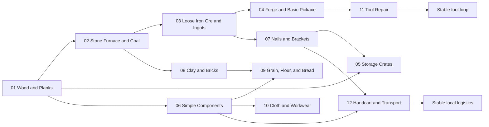

# Production Chains

This document is the index for production chains: paths from a resource to a
product, building, upgrade, or trade good.

At the start, the project can take strong inspiration from Anno: simple resources
lead into increasingly specialized buildings, and the player learns to optimize
material flow, production time, and dependencies between specializations.

## Structure

Specific production chains are stored in:

[production-chains](production-chains)

Files in that directory should be numbered by design order or unlock order in
the game.

Example:

- `00-template.md` - template for new chains,
- `01-wood-and-planks.md` - first starter chain,
- `02-stone-furnace-and-coal.md` - fuel starter chain,
- `03-loose-iron-ore-and-ingots.md` - starter metal chain,
- `04-forge-and-basic-pickaxe.md` - starter tool chain,
- `05-storage-crates.md` - starter logistics chain,
- `06-simple-components.md` - starter component chain,
- `07-nails-and-brackets.md` - starter metal parts chain,
- `08-clay-and-bricks.md` - starter brick chain,
- `09-grain-flour-and-bread.md` - starter food chain,
- `10-cloth-and-workwear.md` - starter textile chain,
- `11-tool-repair.md` - starter repair chain,
- `12-handcart-and-transport.md` - starter transport chain.

## Chain Assumptions

Each chain should be designed like a small economy.

A good chain answers these questions:

- what starting resource begins production,
- what building processes the resource,
- what upgrade or next building unlocks the deeper stage,
- what final product has value for the player or the market,
- where trade first starts to make sense,
- what can be scaled after a few hours of play.

## Template

The best way to start new chains is to copy:

[production-chains/00-template.md](production-chains/00-template.md)

The template includes:

- a Mermaid production graph,
- a building and unlock graph,
- a stage table,
- a recipe table,
- a building and upgrade table,
- an Anno-like balance section,
- a trade and dependencies section.

## Chain List

| Number | Chain | Status | Role |
| --- | --- | --- | --- |
| 01 | [Wood and Planks](production-chains/01-wood-and-planks.md) | Draft | First starter Logging chain |
| 02 | [Stone Furnace and Coal](production-chains/02-stone-furnace-and-coal.md) | Draft | First starter fuel chain |
| 03 | [Loose Iron Ore and Ingots](production-chains/03-loose-iron-ore-and-ingots.md) | Draft | First starter metal chain |
| 04 | [Forge and Basic Pickaxe](production-chains/04-forge-and-basic-pickaxe.md) | Draft | First starter tool chain |
| 05 | [Storage Crates](production-chains/05-storage-crates.md) | Draft | First starter logistics chain |
| 06 | [Simple Components](production-chains/06-simple-components.md) | Draft | First starter component chain |
| 07 | [Nails and Brackets](production-chains/07-nails-and-brackets.md) | Draft | First starter metal parts chain |
| 08 | [Clay and Bricks](production-chains/08-clay-and-bricks.md) | Draft | First stronger construction chain |
| 09 | [Grain, Flour, and Bread](production-chains/09-grain-flour-and-bread.md) | Draft | First starter food chain |
| 10 | [Cloth and Workwear](production-chains/10-cloth-and-workwear.md) | Draft | First starter textile equipment chain |
| 11 | [Tool Repair](production-chains/11-tool-repair.md) | Draft | First tool lifecycle chain |
| 12 | [Handcart and Transport](production-chains/12-handcart-and-transport.md) | Draft | First starter transport chain |

## First 2-3 Hours

The initial production set is planned in:

[First 2-3 Hours Production Plan](08-first-2-hours-production-plan.md)

This plan keeps the player self-sufficient in basic production before stronger
specialization pressure begins. It also defines approximate time-to-reach,
required buildings, and required skills for every starter chain.

## Main Dependency Graph

