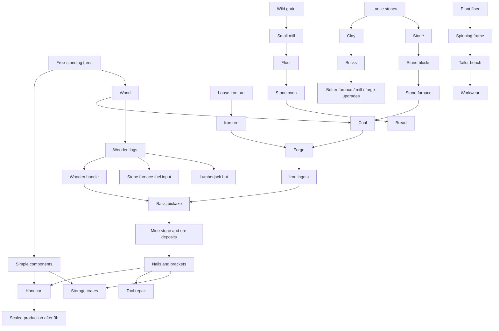

# First 2-3 Hours Production Plan

The first 2-3 hours should teach production chains without forcing the player
into a hard specialization too early. The first 30 minutes happen in the shared
starter settlement described in
[First 30 Minutes: Shared Settlement Without Grind](09-first-30-minutes-shared-settlement.md).
The player's own settlement begins after the founding rite, usually around
20-30 minutes.

The player should be able to become self-sufficient in basic construction,
fuel, simple metal, starter tools, food, storage, and light logistics while
still seeing why trade will matter later.

## Design Goals

- keep the first chains fast to iterate,
- use the shared starter settlement to provide frequent early rewards before
  private base building begins,
- let the player build every basic building with starter resources,
- avoid expensive skill gates before the player understands the economy,
- make wood, stone, coal, iron, planks, food, components, and basic tools useful
  immediately,
- create the first trade pressure only after the player has a working base.

## Item-Scale Philosophy

The early game is about earning individual useful objects, not farming huge
resource totals.

Good early goals:

- craft 1 basic pickaxe,
- produce 4-8 nails for a crate upgrade,
- bake 2 loaves of bread for a stamina burst,
- fire 4-12 bricks for one building upgrade,
- assemble 1 handcart.

Bad early goals:

- gather 80,000 stone,
- smelt hundreds of ingots before the first tool,
- require every building to consume dozens of generic filler components.

Specialist buildings should do the work:

| Building | Early role |
| --- | --- |
| Lumberjack hut with sawmill | Logs and planks |
| Simple workbench | Components, crates, handles, cart frames |
| Stone furnace | Coal and bricks |
| Forge | Ingots, tools, nails, brackets, repairs |
| Small mill | Flour |
| Stone oven | Bread |
| Spinning frame | Rough thread |
| Tailor bench | Cloth and workwear |

## Early Skill Budget

Assumption: the player has enough early talent points to unlock starter nodes in
several specializations.

The first 2 hours should use shallow skill requirements:

| Specialization | Early purpose | Suggested early spend |
| --- | --- | --- |
| Logging | Wood, logs, planks, fuel input | 5-10 points |
| Mining | Stone, loose iron ore, basic mining speed | 5-10 points |
| Smithing | Stone furnace, forge, ingots, pickaxe | 5-10 points |
| Carpentry | Starter components, crates, handles, handcart | 5-10 points |
| Farming | Grain, flour, bread, fiber | 0-5 points |
| Tailoring | Optional workwear | 0-5 points |
| Trading | Optional selling, not required for survival | 0-5 points |

Early production should be possible with roughly 25-45 total points spread
across multiple starter skills. The required path should stay closer to 25-35
points; optional food, workwear, and transport can use the extra points.

Hard specialization choices should begin after the player has:

- a lumberjack hut,
- a stone furnace,
- a forge,
- coal production,
- iron ingot production,
- a basic pickaxe,
- a small storage loop,
- one optional comfort chain such as bread, workwear, or a handcart.

## Phase Plan

| Phase | Time | Player objective | Main unlocks | Design intent |
| --- | --- | --- | --- | --- |
| 1 | 0-15 min | Complete shared settlement onboarding | Logging 1, wooden logs, starter rewards | Immediate activity, social presence, and frequent dopamine hits |
| 2 | 15-30 min | Trigger the shared sawmill and complete the founding rite | Planks, starter path, own settlement | First processed product and transition into private settlement building |
| 3 | 30-50 min | Build starter production in the player's own settlement | Lumberjack hut, stone furnace, simple workbench | City becomes a tool |
| 4 | 45-70 min | Prepare components and storage | Simple components, storage crates | Early buildings need specialist parts |
| 5 | 60-90 min | Process loose iron ore | Forge, iron ingots | Metal becomes possible before deep mining |
| 6 | 80-110 min | Craft basic tools and metal parts | Basic pickaxe, nails, brackets | Mining and upgrades open |
| 7 | 100-140 min | Improve construction materials | Bricks, furnace lining | First slower building material |
| 8 | 110-160 min | Add optional comfort chains | Flour, bread, workwear | Player chooses useful side goals |
| 9 | 140-180 min | Add logistics | Handcart, repair loop | Base feels ready for slower post-3h scale |

## Starter Chain Set

The first 2-3 hours should include these chains:

| Order | Chain | First reached | Required buildings | Required skills | Role |
| --- | --- | --- | --- | --- | --- |
| 01 | Wood and Planks | 0-30 min | Shared sawmill first, then lumberjack hut and sawmill upgrade | Logging 1-2 | Basic construction, early reward pacing, and wood processing |
| 02 | Stone Furnace and Coal | 15-50 min | Stone furnace | Mining 1, Smithing 1 | Fuel production and first processor |
| 03 | Loose Iron Ore and Ingots | 50-90 min | Forge | Mining 1, Smithing 1-2 | Starter metal without requiring a pickaxe first |
| 04 | Forge and Basic Pickaxe | 75-110 min | Forge, simple workbench | Smithing 2, Carpentry 1 | First tool upgrade and deeper mining entry |
| 05 | Storage Crates | 45-90 min | Simple workbench | Carpentry 1 | Small logistics loop |
| 06 | Simple Components | 45-60 min | Simple workbench | Carpentry 1-2 | Early upgrade parts |
| 07 | Nails and Brackets | 85-110 min | Forge | Smithing 2 | Metal parts for upgrades |
| 08 | Clay and Bricks | 100-140 min | Drying rack, stone furnace | Mining 2, Smithing 1 | Better construction material |
| 09 | Grain, Flour, and Bread | 90-150 min | Small mill, stone oven | Farming 1-2 | Optional stamina and worker-food hint |
| 10 | Cloth and Workwear | 110-170 min | Spinning frame, tailor bench | Tailoring 1-2, Farming 1 | Optional equipment chain |
| 11 | Tool Repair | 120-170 min | Forge or tool rack | Smithing 2, Carpentry 1 | Keeps tools valuable |
| 12 | Handcart and Transport | 140-180 min | Simple workbench, forge | Carpentry 2, Smithing 2 | First logistics item |

## Dependency Map

## Self-Sufficiency Rules

For the first 2 hours:

- the player can gather wood, loose stone, and loose iron ore from the map,
- the player can build the stone furnace without metal,
- the player can produce coal before they need the forge,
- the player can smelt loose iron ore with coal,
- the player can craft a basic pickaxe from local materials,
- the player can create simple components in a workbench,
- the player can make a few nails or brackets without mass smelting,
- the player can produce optional bread and workwear without blocking metal,
- the player can repair a worn tool before full replacement becomes painful,
- no starter chain requires a product that only another player can provide.

Trade should be attractive, not mandatory, during this window.

## When Progression Can Slow Down

After the first 2-3 hours, the game can introduce stronger constraints:

- ore deposits require better pickaxes,
- high-volume smelting needs better fuel,
- advanced recipes need components from other specializations,
- upgrades become expensive enough that trade is efficient,
- talent costs increase enough to force real choices.

## Balance Risks

- If coal is too slow, every other chain feels blocked.
- If loose iron ore is too abundant, the basic pickaxe may feel unnecessary.
- If the forge is too cheap, Smithing becomes the obvious best starter path.
- If the player needs too many starter points, experimentation dies early.
- If trade is required before self-sufficiency, new players may feel stuck.
- If food, clothing, repairs, and transport are all mandatory, the early game
  becomes a checklist instead of a readable production ladder.
