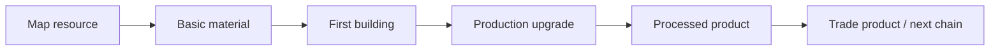
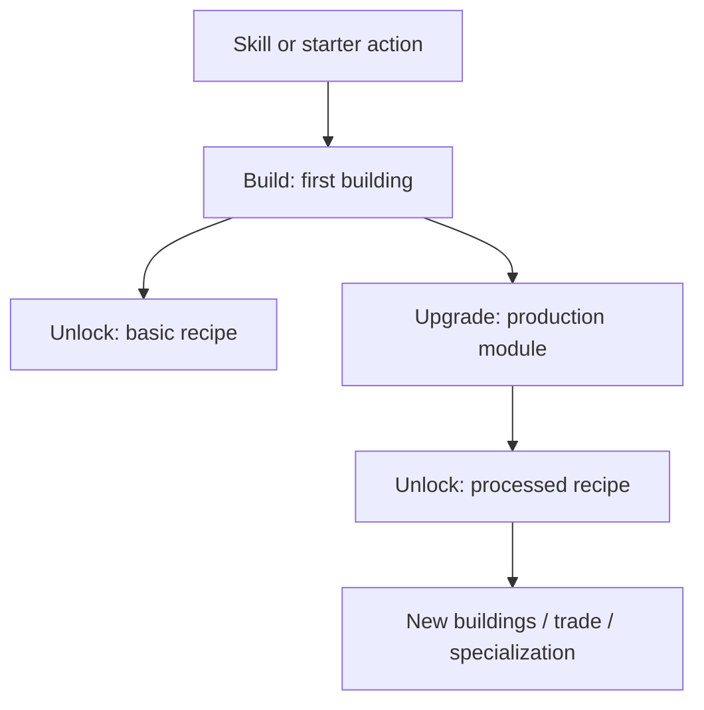

# Chain Template

Copy this file for every new production chain.

## Chain Name

A short description of the player's fantasy.

Example:

> I am a supplier of wood and basic construction materials for other players.

## Summary

| Field | Value |
| --- | --- |
| Main specialization | Logging / Mining / Farming / Smithing / Carpentry |
| Player stage | Early game / Mid game / Late game |
| Starting resource | Resource name |
| Final product | Product name |
| First building | Building name |
| First upgrade | Upgrade name |
| First trade moment | What another player can buy |

## Production Graph

PHPStorm Markdown preview supports Mermaid, so diagrams can be kept directly in
`.md` files.

## Building And Unlock Graph

## Chain Stages

| Stage | Player action | Input | Output | Building | Design goal |
| --- | --- | --- | --- | --- | --- |
| 1 | Gathers resource | None | Resource | None | First contact with the system |
| 2 | Processes resource | Resource | Material | Simple building or manual action | Showing recipes |
| 3 | Builds infrastructure | Material | Building | Construction site | City as a production tool |
| 4 | Upgrades building | Material + cost | Upgrade | Base building | Unlocking deeper production |
| 5 | Produces goods | Material | Product | Upgraded building | First market product |

## Recipes

| Recipe | Input | Output | Time | Building | Notes |
| --- | --- | --- | --- | --- | --- |
| Recipe name | 5 resources | 1 product | 30 s | Building | To be decided |

## Buildings And Upgrades

| Object | Type | Cost | Unlocks | Role |
| --- | --- | --- | --- | --- |
| Building name | Building | Build cost | Recipes | Function in the city |
| Upgrade name | Upgrade | Upgrade cost | Recipes | Function in the chain |

## Anno-Like Balance

This section helps reason about throughput.

| Question | Answer |
| --- | --- |
| How much raw resource is needed for 1 final product? | To be decided |
| Does one input building feed one processing building? | To be decided |
| Does the chain have a bottleneck? | To be decided |
| Is the product used locally or sold? | To be decided |
| Does the chain require other specializations? | To be decided |

## Trade And Dependencies

Describe who may need the product.

Example:

- a miner needs planks for a warehouse,
- a farmer needs planks for fences,
- a carpenter needs planks for furniture.

## Design Risks

Briefly list problems that could break the chain.

Example:

- too much manual clicking at the start,
- automation unlocks too quickly,
- the product has no use outside the player's own city,
- the chain creates no trade dependency.
