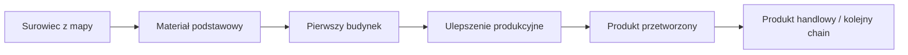
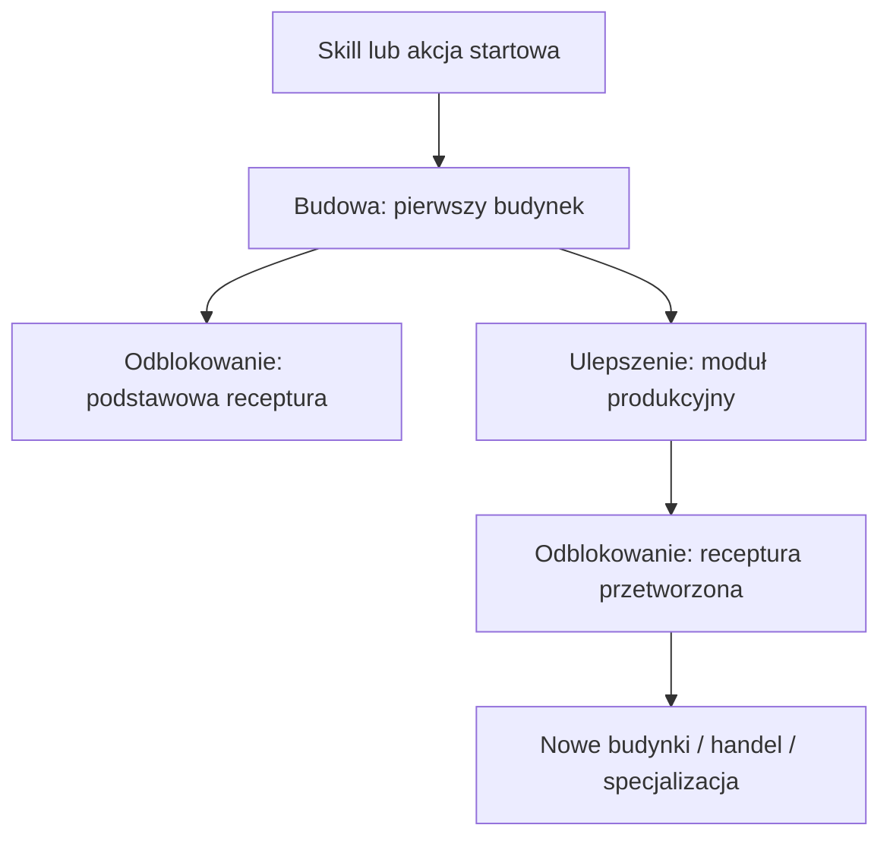

# Template Chainu

Kopiuj ten plik dla każdego nowego łańcucha produkcji.

## Nazwa Chainu

Krótki opis fantazji gracza.

Przykład:

> Jestem dostawcą drewna i podstawowych materiałów budowlanych dla innych graczy.

## Podsumowanie

| Pole | Wartość |
| --- | --- |
| Specjalizacja główna | Logging / Mining / Farming / Smithing / Carpentry |
| Poziom gracza | Early game / Mid game / Late game |
| Surowiec startowy | Nazwa surowca |
| Produkt końcowy | Nazwa produktu |
| Pierwszy budynek | Nazwa budynku |
| Pierwsze ulepszenie | Nazwa ulepszenia |
| Pierwszy moment handlu | Co inny gracz może kupić |

## Graph Produkcji

PHPStorm Markdown preview obsługuje Mermaid, więc diagramy można trzymać
bezpośrednio w plikach `.md`.

## Graph Budynków I Odblokowań

## Etapy Chainu

| Etap | Akcja gracza | Wejście | Wyjście | Budynek | Cel projektowy |
| --- | --- | --- | --- | --- | --- |
| 1 | Zbiera surowiec | Brak | Surowiec | Brak | Pierwszy kontakt z systemem |
| 2 | Przetwarza surowiec | Surowiec | Materiał | Prosty budynek albo ręczna akcja | Pokazanie receptur |
| 3 | Buduje infrastrukturę | Materiał | Budynek | Plac budowy | Miasto jako narzędzie produkcji |
| 4 | Ulepsza budynek | Materiał + koszt | Ulepszenie | Budynek bazowy | Odblokowanie głębszej produkcji |
| 5 | Produkuje towar | Materiał | Produkt | Ulepszony budynek | Pierwszy produkt rynkowy |

## Receptury

| Receptura | Wejście | Wyjście | Czas | Budynek | Uwagi |
| --- | --- | --- | --- | --- | --- |
| Nazwa receptury | 5 surowca | 1 produkt | 30 s | Budynek | Do ustalenia |

## Budynki I Ulepszenia

| Obiekt | Typ | Koszt | Odblokowuje | Rola |
| --- | --- | --- | --- | --- |
| Nazwa budynku | Budynek | Koszt budowy | Receptury | Funkcja w mieście |
| Nazwa ulepszenia | Ulepszenie | Koszt ulepszenia | Receptury | Funkcja w chainie |

## Balans Anno-Like

Ta sekcja pomaga myśleć o przepustowości.

| Pytanie | Odpowiedź |
| --- | --- |
| Ile surowca potrzeba na 1 produkt końcowy? | Do ustalenia |
| Czy jeden budynek wejściowy zasila jeden budynek przetwarzający? | Do ustalenia |
| Czy chain ma wąskie gardło? | Do ustalenia |
| Czy produkt jest używany lokalnie, czy sprzedawany? | Do ustalenia |
| Czy chain wymaga innych specjalizacji? | Do ustalenia |

## Handel I Zależności

Opisz, kto może potrzebować produktu.

Przykład:

- górnik potrzebuje desek do magazynu,
- farmer potrzebuje desek do ogrodzeń,
- stolarz potrzebuje desek do mebli.

## Ryzyka Projektowe

Krótko wypisz problemy, które mogą zepsuć chain.

Przykład:

- za dużo ręcznego klikania na początku,
- zbyt szybkie odblokowanie automatyzacji,
- produkt nie ma zastosowania poza własnym miastem,
- chain nie tworzy żadnej zależności handlowej.
