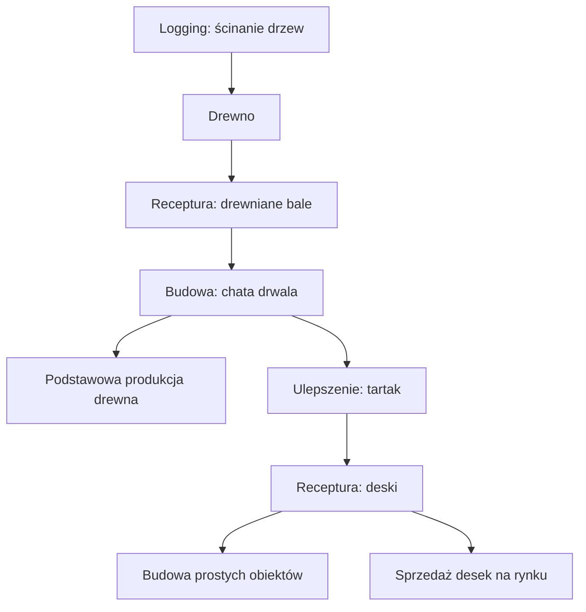

# Chain 1: Drewno I Deski

Gracz zaczyna jako prosty dostawca drewna. Ścina wolno stojące drzewa, przerabia
drewno na drewniane bale, buduje chatę drwala, a potem dodaje ulepszenie tartaku,
żeby produkować deski.

## Podsumowanie

| Pole | Wartość |
| --- | --- |
| Specjalizacja główna | Logging |
| Specjalizacja poboczna | Carpentry |
| Poziom gracza | Early game |
| Surowiec startowy | Drewno z wolno stojących drzew |
| Materiał budowlany | Drewniane bale |
| Produkt końcowy | Deski |
| Pierwszy budynek | Chata drwala |
| Pierwsze ulepszenie | Tartak |
| Pierwszy moment handlu | Sprzedaż desek innym graczom |

## Graph Produkcji

## Graph Budynków I Odblokowań

## Etapy Chainu

| Etap | Akcja gracza | Wejście | Wyjście | Budynek | Cel projektowy |
| --- | --- | --- | --- | --- | --- |
| 1 | Ścina wolno stojące drzewa | Brak | Drewno | Brak | Natychmiastowy start gry |
| 2 | Tworzy drewniane bale | Drewno | Drewniane bale | Ręcznie albo przy chacie drwala | Pierwszy materiał budowlany |
| 3 | Buduje chatę drwala | Drewniane bale | Chata drwala | Plac budowy | Pierwsza infrastruktura produkcyjna |
| 4 | Dodaje tartak | Drewniane bale + komponent | Ulepszenie tartaku | Chata drwala | Pierwsze ulepszenie budynku |
| 5 | Produkuje deski | Drewniane bale | Deski | Chata drwala z tartakiem | Pierwszy produkt przetworzony |

## Receptury

| Receptura | Wejście | Wyjście | Czas | Budynek | Uwagi |
| --- | --- | --- | --- | --- | --- |
| Zbieranie drewna | Drzewo na mapie | Drewno | Krótki czas akcji | Brak | Ręczna aktywność startowa |
| Drewniane bale | 5 drewna | 1 drewniany bal | 10 s | Ręcznie / chata drwala | Materiał budowlany |
| Deski | 1 drewniany bal | 3 deski | 20 s | Chata drwala z tartakiem | Pierwszy produkt handlowy |

## Budynki I Ulepszenia

| Obiekt | Typ | Koszt | Odblokowuje | Rola |
| --- | --- | --- | --- | --- |
| Chata drwala | Budynek | 10 drewnianych bali | Podstawowa produkcja drewna | Pierwszy budynek Logging |
| Tartak | Ulepszenie | 15 drewnianych bali + prosty komponent | Produkcja desek | Pierwszy krok w stronę Carpentry |

## Balans Anno-Like

| Pytanie | Odpowiedź |
| --- | --- |
| Ile surowca potrzeba na 1 produkt końcowy? | 5 drewna -> 1 bal -> 3 deski |
| Czy jeden budynek wejściowy zasila jeden budynek przetwarzający? | Na start tak, później można skalować liczbę tartaków |
| Czy chain ma wąskie gardło? | Drewniane bale, bo są potrzebne i do budowy, i do produkcji desek |
| Czy produkt jest używany lokalnie, czy sprzedawany? | Oba zastosowania powinny być sensowne |
| Czy chain wymaga innych specjalizacji? | Nie na początku, ale prosty komponent do tartaku może pochodzić od innej specjalizacji później |

## Handel I Zależności

Deski mogą być pierwszym produktem, który ma sens sprzedać innym graczom.

Potencjalni kupujący:

- Mining: deski do prostego magazynu,
- Farming: deski do ogrodzeń i skrzyń,
- Carpentry: deski do mebli,
- Trading: deski do skrzyń transportowych.

## Ryzyka Projektowe

- Chain może być zbyt liniowy, jeśli deski służą tylko do jednego budynku.
- Zbyt szybki tartak może odebrać wartość ręcznemu zbieraniu drewna.
- Zbyt drogi tartak może spowolnić pierwsze minuty gry.
- Jeśli deski nie będą potrzebne innym specjalizacjom, pierwszy handel pojawi się za późno.

## Następne Możliwe Rozszerzenia

- Belki jako mocniejszy materiał konstrukcyjny.
- Proste meble jako pierwszy produkt Carpentry.
- Lepsze siekiery od kowala, które zwiększają wydajność Logging.
- NPC drwal, który automatyzuje ścinanie po kilku godzinach progresji.
