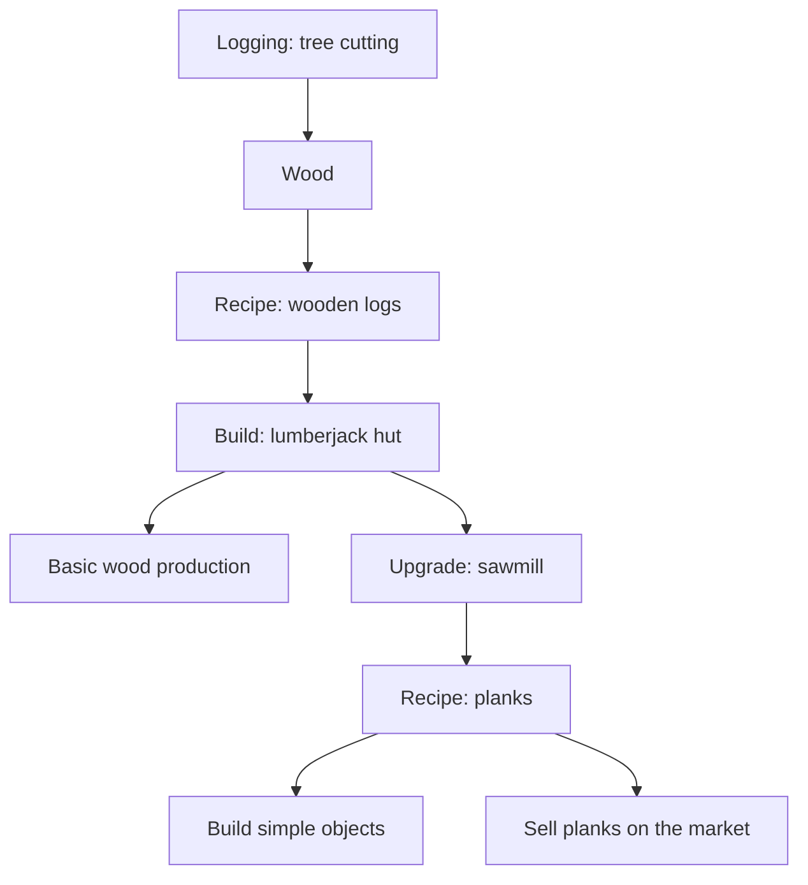

# Chain 1: Wood And Planks

The player starts as a simple wood supplier. They cut down free-standing trees,
process wood into wooden logs, build a lumberjack hut, and then add a sawmill
upgrade to produce planks.

## Summary

| Field | Value |
| --- | --- |
| Main specialization | Logging |
| Side specialization | Carpentry |
| Player stage | Early game |
| Starting resource | Wood from free-standing trees |
| Construction material | Wooden logs |
| Final product | Planks |
| First building | Lumberjack hut |
| First upgrade | Sawmill |
| First unlock time | Around 0-30 min |
| Skill requirement | Logging 1-2, Carpentry 0-1 |
| First trade moment | Selling planks to other players |

## Production Graph

## Building And Unlock Graph

## Progression Timing

| Time reached | Requirement | Expected player state |
| --- | --- | --- |
| 0-10 min | Wood gathering | Player learns the first map resource |
| 10-20 min | Wooden logs | Player has the first construction material |
| 20-30 min | Lumberjack hut and sawmill path | Player starts dedicated wood processing |

## Chain Stages

| Stage | Player action | Input | Output | Building | Design goal |
| --- | --- | --- | --- | --- | --- |
| 1 | Cuts down free-standing trees | None | Wood | None | Immediate game start |
| 2 | Creates wooden logs | Wood | Wooden logs | Manually or at a lumberjack hut | First construction material |
| 3 | Builds a lumberjack hut | Wooden logs | Lumberjack hut | Construction site | First production infrastructure |
| 4 | Adds a sawmill | Wooden logs + component | Sawmill upgrade | Lumberjack hut | First building upgrade |
| 5 | Produces planks | Wooden logs | Planks | Lumberjack hut with sawmill | First processed product |

## Recipes

| Recipe | Input | Output | Time | Building | Notes |
| --- | --- | --- | --- | --- | --- |
| Wood gathering | Tree on the map | Wood | Short action time | None | Manual starter activity |
| Wooden logs | 5 wood | 1 wooden log | 10 s | Manual / lumberjack hut | Construction material |
| Planks | 1 wooden log | 3 planks | 20 s | Lumberjack hut with sawmill | First trade product |

## Buildings And Upgrades

| Object | Type | Cost | Unlocks | Role |
| --- | --- | --- | --- | --- |
| Lumberjack hut | Building | 10 wooden logs | Basic wood production | First Logging building |
| Sawmill | Upgrade | 15 wooden logs + simple component | Plank production | First step toward Carpentry |

## Skill And Building Requirements

| Unlock | Skill | Building | Notes |
| --- | --- | --- | --- |
| Wood gathering | Logging 1 | None | Immediate starter activity |
| Wooden logs | Logging 1 | Manual / lumberjack hut | First construction material |
| Sawmill upgrade | Logging 2 or Carpentry 1 | Lumberjack hut | Should arrive before 30 min |
| Planks | Logging 2 | Lumberjack hut with sawmill | Core early material |

## Anno-Like Balance

| Question | Answer |
| --- | --- |
| How much raw resource is needed for 1 final product? | 5 wood -> 1 log -> 3 planks |
| Does one input building feed one processing building? | At the start, yes; later the number of sawmills can scale |
| Does the chain have a bottleneck? | Wooden logs, because they are needed both for building and for plank production |
| Is the product used locally or sold? | Both uses should make sense |
| Does the chain require other specializations? | Not at the start, but the simple component for the sawmill can come from another specialization later |

## Trade And Dependencies

Planks can be the first product that makes sense to sell to other players.

Potential buyers:

- Mining: planks for a simple warehouse,
- Farming: planks for fences and crates,
- Carpentry: planks for furniture,
- Trading: planks for transport crates.

## Design Risks

- The chain may be too linear if planks are used for only one building.
- A sawmill that unlocks too quickly may reduce the value of manual wood gathering.
- A sawmill that is too expensive may slow down the first minutes of the game.
- If other specializations do not need planks, the first trade moment appears too late.

## Possible Next Expansions

- Beams as a stronger construction material.
- Simple furniture as the first Carpentry product.
- Better axes from a blacksmith, increasing Logging efficiency.
- An NPC lumberjack that automates cutting after a few hours of progression.
