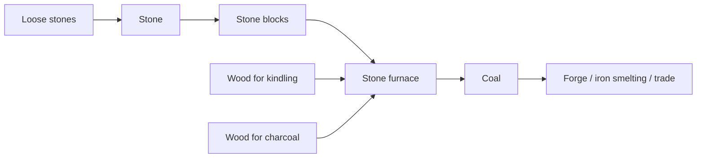
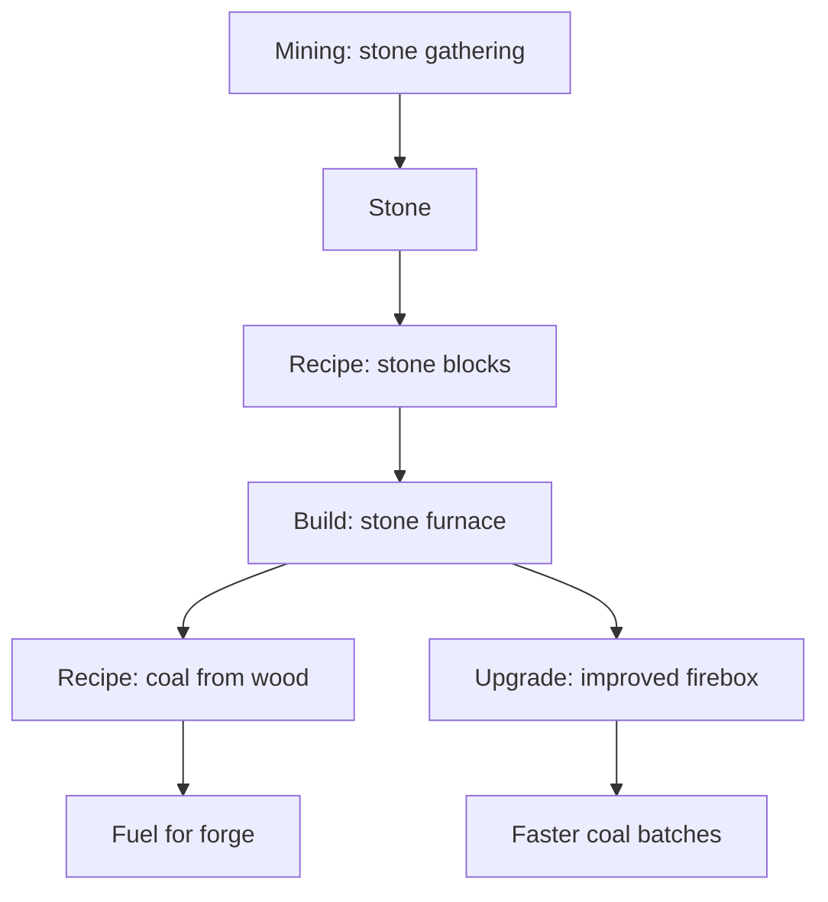

# Chain 2: Stone Furnace And Coal

The player gathers loose stones, turns them into stone blocks, builds a stone
furnace, and uses wood as both kindling and raw material to produce coal.

This chain is the first clear example of a production dependency: wood is no
longer only a construction material, but also a fuel input and a processed fuel
product.

## Summary

| Field | Value |
| --- | --- |
| Main specialization | Mining |
| Side specialization | Smithing |
| Player stage | Early game |
| Starting resource | Loose stones on the map |
| Construction material | Stone blocks |
| Final product | Coal |
| First building | Stone furnace |
| First upgrade | Improved firebox |
| First unlock time | Around 15-50 min |
| Skill requirement | Mining 1, Smithing 1 |
| First trade moment | Selling coal to early smiths |

## Production Graph

## Building And Unlock Graph

## Progression Timing

| Time reached | Requirement | Expected player state |
| --- | --- | --- |
| 0-15 min | Loose stone gathering | Player has starter stone |
| 15-30 min | Stone blocks | Player can build a furnace without metal |
| 30-50 min | Coal batches | Player has fuel for the forge |

## Chain Stages

| Stage | Player action | Input | Output | Building | Design goal |
| --- | --- | --- | --- | --- | --- |
| 1 | Picks up loose stones | None | Stone | None | Manual starter Mining |
| 2 | Makes stone blocks | Stone | Stone blocks | Manual / construction site | First stone construction material |
| 3 | Builds a stone furnace | Stone blocks + wooden logs | Stone furnace | Construction site | First processing building for fuel |
| 4 | Adds wood as kindling | Wood | Furnace heat | Stone furnace | Teaches fuel slots |
| 5 | Converts wood into coal | Wood + heat | Coal | Stone furnace | Unlocks forge fuel |

## Recipes

| Recipe | Input | Output | Time | Building | Notes |
| --- | --- | --- | --- | --- | --- |
| Stone gathering | Loose stone on the map | Stone | Short action time | None | Starter activity |
| Stone blocks | 4 stone | 1 stone block | 10 s | Manual / construction site | Building material |
| Coal batch | 2 wood as kindling + 6 wood as material | 3 coal | 30 s | Stone furnace | First fuel product |

## Buildings And Upgrades

| Object | Type | Cost | Unlocks | Role |
| --- | --- | --- | --- | --- |
| Stone furnace | Building | 12 stone blocks + 4 wooden logs | Coal production | Starter fuel processor |
| Improved firebox | Upgrade | 8 stone blocks + 5 coal | Faster coal batches | First efficiency upgrade |

## Skill And Building Requirements

| Unlock | Skill | Building | Notes |
| --- | --- | --- | --- |
| Stone gathering | Mining 1 | None | Starter Mining action |
| Stone blocks | Mining 1 | Manual / construction site | First stone material |
| Stone furnace | Smithing 1 | Construction site | Must not require metal |
| Coal batch | Smithing 1 | Stone furnace | First fuel recipe |

## Anno-Like Balance

| Question | Answer |
| --- | --- |
| How much raw resource is needed for 1 final product? | About 8 wood -> 3 coal |
| Does one input building feed one processing building? | One early wood source should feed one stone furnace |
| Does the chain have a bottleneck? | Wood, because it is used for construction, kindling, and coal material |
| Is the product used locally or sold? | Mostly local at first, tradable after the forge is stable |
| Does the chain require other specializations? | No, but Logging improves it strongly |

## Trade And Dependencies

Coal is the first fuel product with obvious market value.

Potential buyers:

- Smithing: coal for smelting iron ore,
- Mining: coal for stronger mining upgrades later,
- Cooking: coal for ovens after the early game,
- Trading: coal as a high-demand starter commodity.

## Design Risks

- If coal requires too much wood, Logging becomes mandatory too early.
- If coal production is instant, fuel stops feeling like a meaningful chain.
- If the furnace costs metal, the player cannot become self-sufficient.
- If the improved firebox is too strong, the first furnace upgrade may be mandatory.

## Possible Next Expansions

- Charcoal quality tiers.
- Coke as a later, stronger Smithing fuel.
- Furnace temperature as a recipe requirement.
- Dedicated charcoal kiln as a Logging or Smithing branch.
