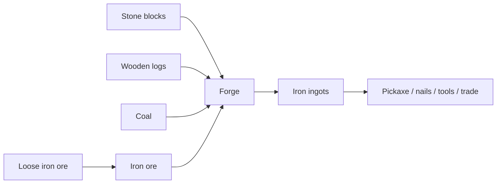
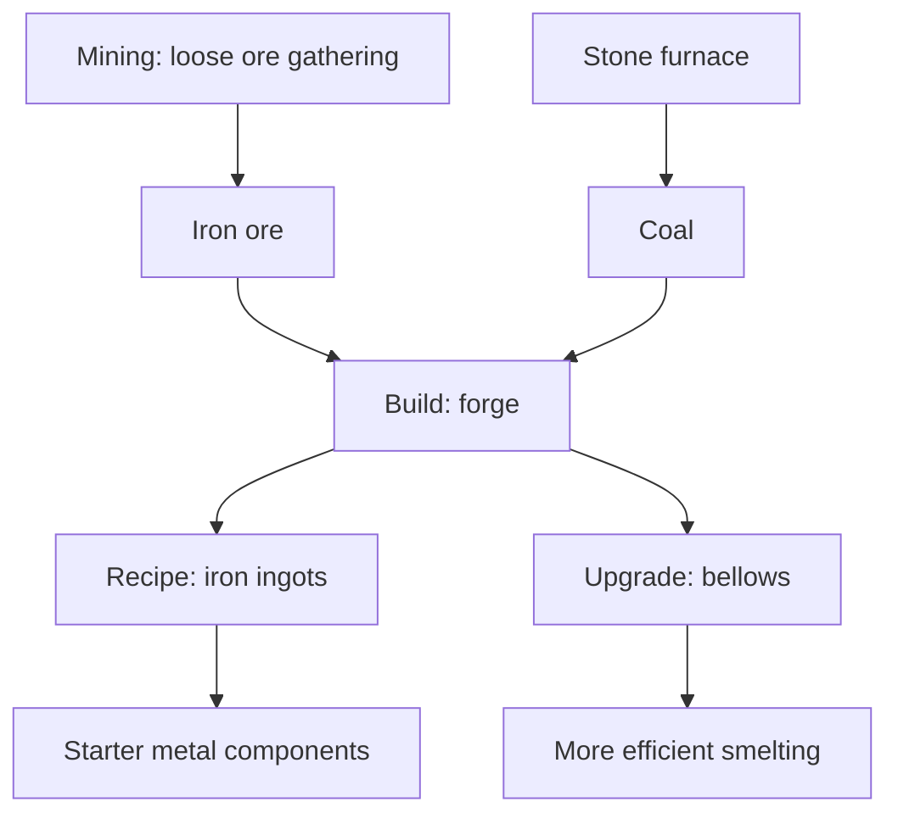

# Chain 3: Loose Iron Ore And Ingots

The player gathers loose iron ore from the map, builds a forge, uses coal from
the stone furnace as fuel, and smelts the ore into iron ingots.

The important design rule is that the first iron does not require a pickaxe.
The pickaxe is the reward for this chain, not its prerequisite.

## Summary

| Field | Value |
| --- | --- |
| Main specialization | Smithing |
| Side specialization | Mining |
| Player stage | Early game |
| Starting resource | Loose iron ore on the map |
| Construction material | Stone blocks and wooden logs |
| Final product | Iron ingots |
| First building | Forge |
| First upgrade | Bellows |
| First unlock time | Around 50-90 min |
| Skill requirement | Mining 1, Smithing 1-2 |
| First trade moment | Selling iron ingots to tool makers |

## Production Graph

## Building And Unlock Graph

## Progression Timing

| Time reached | Requirement | Expected player state |
| --- | --- | --- |
| 30-50 min | Coal production | Player can fuel a forge |
| 50-75 min | Forge construction | Player can begin Smithing |
| 60-90 min | First iron ingots | Player prepares for tool crafting |

## Chain Stages

| Stage | Player action | Input | Output | Building | Design goal |
| --- | --- | --- | --- | --- | --- |
| 1 | Finds loose iron ore | None | Iron ore | None | Lets metal start before tools |
| 2 | Produces coal | Wood | Coal | Stone furnace | Connects fuel chain to metal chain |
| 3 | Builds a forge | Stone blocks + wooden logs | Forge | Construction site | First Smithing building |
| 4 | Smelts ore | Iron ore + coal | Iron ingots | Forge | First metal material |
| 5 | Adds bellows | Stone blocks + planks + ingots | Bellows upgrade | Forge | First forge efficiency upgrade |

## Recipes

| Recipe | Input | Output | Time | Building | Notes |
| --- | --- | --- | --- | --- | --- |
| Loose iron ore gathering | Loose ore on the map | Iron ore | Short action time | None | Limited starter resource |
| Iron ingots | 3 iron ore + 2 coal | 1 iron ingot | 45 s | Forge | Starter metal recipe |
| Efficient iron batch | 5 iron ore + 3 coal | 2 iron ingots | 60 s | Forge with bellows | Better throughput after upgrade |

## Buildings And Upgrades

| Object | Type | Cost | Unlocks | Role |
| --- | --- | --- | --- | --- |
| Forge | Building | 10 stone blocks + 6 wooden logs + 4 coal | Iron smelting | Starter Smithing building |
| Bellows | Upgrade | 8 planks + 4 iron ingots | Efficient iron batch | First Smithing efficiency upgrade |

## Skill And Building Requirements

| Unlock | Skill | Building | Notes |
| --- | --- | --- | --- |
| Loose iron ore | Mining 1 | None | Limited starter ore before pickaxe |
| Forge | Smithing 1 | Construction site | Uses stone, logs, and coal |
| Iron ingots | Smithing 1-2 | Forge | First metal material |
| Bellows | Smithing 2 | Forge | Optional before the 2h mark |

## Anno-Like Balance

| Question | Answer |
| --- | --- |
| How much raw resource is needed for 1 final product? | 3 loose iron ore + 2 coal -> 1 ingot |
| Does one input building feed one processing building? | One stone furnace can feed one forge during the first hour |
| Does the chain have a bottleneck? | Coal, because it also gates tools |
| Is the product used locally or sold? | Mostly local until the player crafts a pickaxe |
| Does the chain require other specializations? | It needs basic Mining and fuel from the furnace chain, but no advanced specialization |

## Trade And Dependencies

Iron ingots should be valuable, but not required from other players during the
first 2 hours.

Potential buyers:

- Tool makers: ingots for pickaxes and axes,
- Builders: nails and brackets after early game,
- Traders: ingots as compact value,
- Advanced smiths: ingots for steel chain later.

## Design Risks

- If loose iron ore is too rare, players get stuck before the pickaxe.
- If loose iron ore is too common, deposit mining feels like a weak upgrade.
- If ingots require too much coal, the coal chain becomes frustrating.
- If bellows require too many ingots, the upgrade competes too hard with tools.

## Possible Next Expansions

- Iron nails and brackets for better buildings.
- Copper or tin as parallel starter metals.
- Ore quality tiers.
- Steel as a slower post-2h chain.
