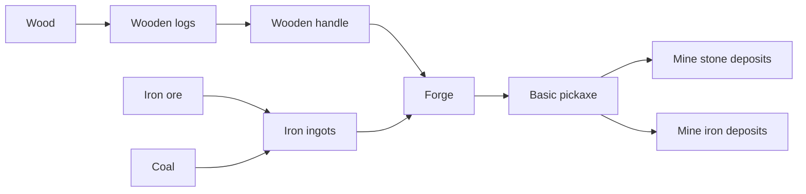
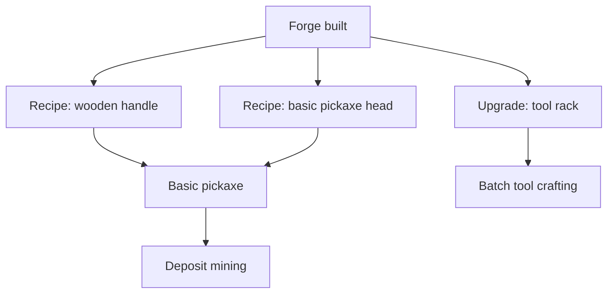

# Chain 4: Forge And Basic Pickaxe

The player uses iron ingots from the forge and a wooden handle from the wood
chain to craft a basic pickaxe.

This is the first tool chain that changes how the player interacts with the map:
loose resources are no longer the only option, and stone or ore deposits can now
be mined directly.

## Summary

| Field | Value |
| --- | --- |
| Main specialization | Smithing |
| Side specialization | Mining and Logging |
| Player stage | Early game |
| Starting resource | Iron ingots |
| Construction material | Wooden handle |
| Final product | Basic pickaxe |
| First building | Forge |
| First upgrade | Tool rack |
| First unlock time | Around 75-110 min |
| Skill requirement | Smithing 2, Carpentry 1, Mining 1 |
| First trade moment | Selling basic pickaxes to miners |

## Production Graph

## Building And Unlock Graph

## Progression Timing

| Time reached | Requirement | Expected player state |
| --- | --- | --- |
| 60-90 min | Iron ingots | Player can make metal parts |
| 75-100 min | Wooden handle and pickaxe head | Player combines wood and metal |
| 90-110 min | Basic pickaxe | Player unlocks deposit mining |

## Chain Stages

| Stage | Player action | Input | Output | Building | Design goal |
| --- | --- | --- | --- | --- | --- |
| 1 | Produces iron ingots | Iron ore + coal | Iron ingots | Forge | Uses previous chain |
| 2 | Shapes a wooden handle | Wooden logs | Wooden handle | Manual / lumberjack hut | Connects wood to tools |
| 3 | Crafts a pickaxe head | Iron ingots + coal | Pickaxe head | Forge | First tool component |
| 4 | Assembles basic pickaxe | Pickaxe head + wooden handle | Basic pickaxe | Forge | First map-interaction upgrade |
| 5 | Mines deposits | Pickaxe durability | Stone and ore | Map deposits | Unlocks scaling after 2h |

## Recipes

| Recipe | Input | Output | Time | Building | Notes |
| --- | --- | --- | --- | --- | --- |
| Wooden handle | 1 wooden log | 2 wooden handles | 15 s | Manual / lumberjack hut | Starter tool component |
| Pickaxe head | 2 iron ingots + 1 coal | 1 pickaxe head | 35 s | Forge | First metal tool part |
| Basic pickaxe | 1 pickaxe head + 1 wooden handle | 1 basic pickaxe | 20 s | Forge | Opens deposit mining |

## Buildings And Upgrades

| Object | Type | Cost | Unlocks | Role |
| --- | --- | --- | --- | --- |
| Tool rack | Upgrade | 6 planks + 2 iron ingots | Tool storage and batch crafting | Small quality-of-life upgrade |
| Basic pickaxe | Tool | 2 iron ingots + 1 coal + 1 wooden handle | Deposit mining | First Mining tool |

## Skill And Building Requirements

| Unlock | Skill | Building | Notes |
| --- | --- | --- | --- |
| Wooden handle | Carpentry 1 | Manual / simple workbench | Cheap tool component |
| Pickaxe head | Smithing 2 | Forge | First tool head |
| Basic pickaxe | Smithing 2, Mining 1 | Forge | Opens stone and ore deposits |
| Tool rack | Smithing 2 or Carpentry 2 | Forge | Optional quality-of-life upgrade |

## Anno-Like Balance

| Question | Answer |
| --- | --- |
| How much raw resource is needed for 1 final product? | 2 ingots + 1 coal + half a log -> 1 pickaxe |
| Does one input building feed one processing building? | One forge can produce both ingots and pickaxes early, but it becomes a bottleneck |
| Does the chain have a bottleneck? | Forge time, because smelting and tool crafting use the same building |
| Is the product used locally or sold? | Local first, tradable once players specialize |
| Does the chain require other specializations? | It needs starter wood and metal, but no advanced specialization |

## Trade And Dependencies

The basic pickaxe is an early trade product once some players decide not to
invest in Smithing.

Potential buyers:

- Miners: pickaxes for deposit mining,
- Builders: stone supply acceleration,
- Traders: starter tool bundles,
- Loggers: later upgraded axes can reuse the same tool logic.

## Design Risks

- If the pickaxe is too durable, tool makers lose repeat demand.
- If the pickaxe breaks too quickly, the first tool feels punishing.
- If pickaxes require advanced Smithing, Mining cannot start naturally.
- If deposits are available too early, loose resource gathering becomes obsolete
  before the player understands it.

## Possible Next Expansions

- Copper pickaxe as a cheaper alternative.
- Iron pickaxe as the first post-2h upgrade.
- Tool durability and repair.
- Tool quality based on Smithing skill.
