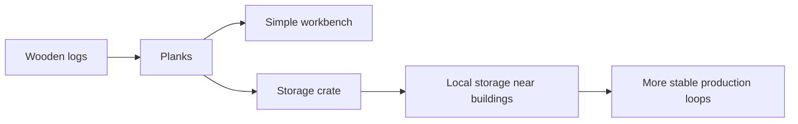
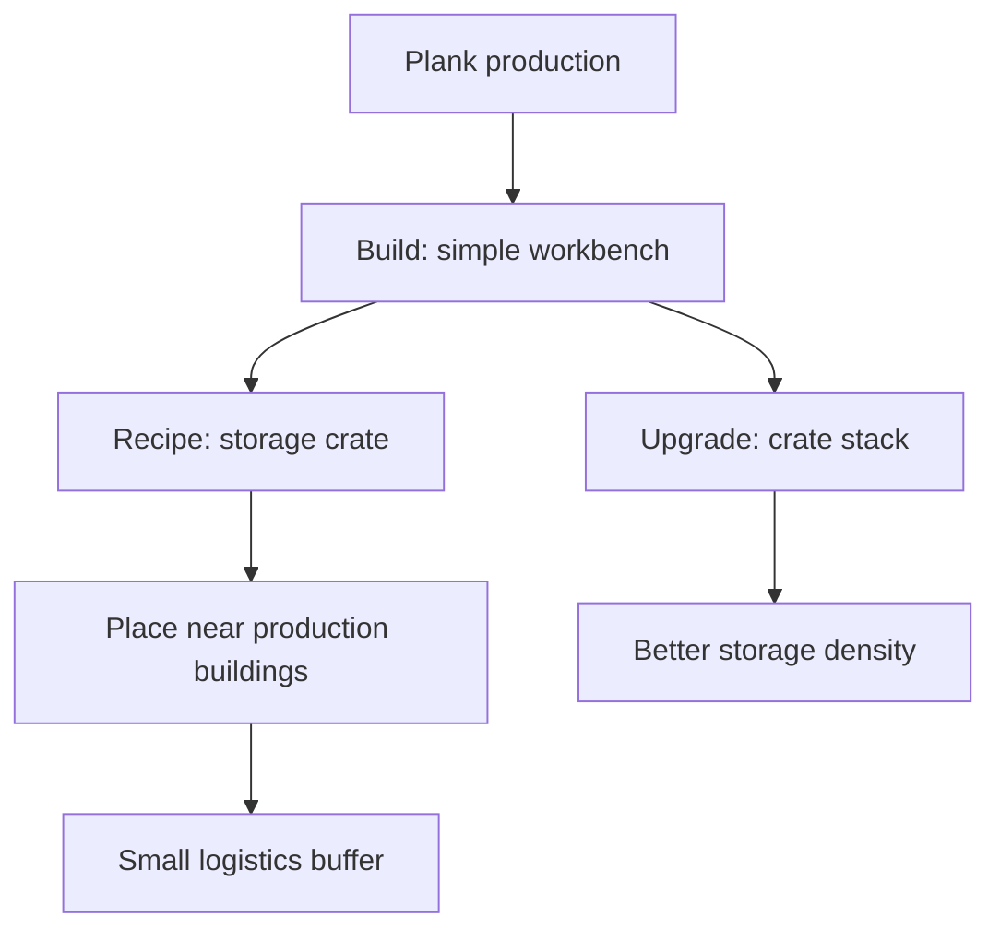

# Chain 5: Storage Crates

The player uses planks to craft storage crates, then places them near production
buildings to increase local storage and make small production loops easier to
manage.

This is not a deep production chain, but it gives early planks a practical use
before advanced furniture or trade goods exist.

## Summary

| Field | Value |
| --- | --- |
| Main specialization | Carpentry |
| Side specialization | Logging |
| Player stage | Early game |
| Starting resource | Planks |
| Construction material | Planks |
| Final product | Storage crates |
| First building | Simple workbench |
| First upgrade | Crate stack |
| First unlock time | Around 45-90 min |
| Skill requirement | Carpentry 1 |
| First trade moment | Selling crates to players with growing production |

## Production Graph

## Building And Unlock Graph

## Progression Timing

| Time reached | Requirement | Expected player state |
| --- | --- | --- |
| 30-45 min | Plank production | Player has processed wood |
| 45-60 min | Simple workbench | Player can craft dedicated objects |
| 60-90 min | Storage crates | Player starts buffering production |

## Chain Stages

| Stage | Player action | Input | Output | Building | Design goal |
| --- | --- | --- | --- | --- | --- |
| 1 | Produces planks | Wooden logs | Planks | Sawmill | Reuses wood chain |
| 2 | Builds simple workbench | Planks + wooden logs | Simple workbench | Construction site | First light Carpentry station |
| 3 | Crafts storage crate | Planks | Storage crate | Simple workbench | First logistics object |
| 4 | Places crate near production | Storage crate | Local storage | City placement | Teaches production layout |
| 5 | Upgrades crate stack | Planks + iron nails later | Crate stack | Workbench | Post-starter storage scaling |

## Recipes

| Recipe | Input | Output | Time | Building | Notes |
| --- | --- | --- | --- | --- | --- |
| Simple workbench | 6 planks + 2 wooden logs | Simple workbench | 20 s | Construction site | Starter crafting station |
| Storage crate | 4 planks | 1 storage crate | 20 s | Simple workbench | Early storage object |
| Crate stack | 3 storage crates + 2 planks | 1 crate stack | 30 s | Simple workbench | Better storage density |

## Buildings And Upgrades

| Object | Type | Cost | Unlocks | Role |
| --- | --- | --- | --- | --- |
| Simple workbench | Building | 6 planks + 2 wooden logs | Crates and simple components | Starter Carpentry station |
| Storage crate | Placeable object | 4 planks | Local storage | Small logistics buffer |
| Crate stack | Upgrade / object | 3 crates + 2 planks | Higher storage density | Early scaling |

## Skill And Building Requirements

| Unlock | Skill | Building | Notes |
| --- | --- | --- | --- |
| Simple workbench | Carpentry 1 | Construction site | First specialist object station |
| Storage crate | Carpentry 1 | Simple workbench | Small local buffer |
| Crate stack | Carpentry 2 | Simple workbench | Optional upgrade before 2h |

## Anno-Like Balance

| Question | Answer |
| --- | --- |
| How much raw resource is needed for 1 final product? | About 2 wooden logs -> 1 crate, depending on plank yield |
| Does one input building feed one processing building? | One sawmill can feed one simple workbench at the start |
| Does the chain have a bottleneck? | Planks, because they are used for buildings, tools, and crates |
| Is the product used locally or sold? | Local first, sold once production-heavy players need storage |
| Does the chain require other specializations? | No for starter crates; later upgrades can use Smithing components |

## Trade And Dependencies

Storage crates are useful for every player type, which makes them a natural
low-risk early trade product.

Potential buyers:

- Smithing: crates near forge and furnace,
- Mining: crates near ore drop-off,
- Logging: crates near lumberjack hut,
- Trading: crates as part of starter production bundles.

## Design Risks

- If crates are only cosmetic, the chain has no gameplay value.
- If storage is too restrictive without crates, the player feels forced into
  Carpentry.
- If crates are too cheap, inventory and warehouse upgrades may lose value.
- If placement is annoying, logistics becomes friction instead of planning.

## Possible Next Expansions

- Specialized crates for ore, fuel, food, or tools.
- Transport crates as the first Trading product.
- Warehouse modules.
- Worker delivery routes after the first few hours.
