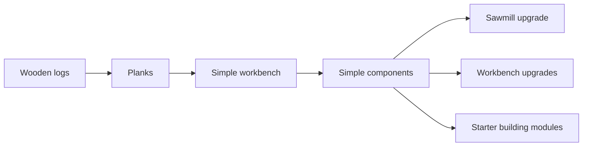

# Chain 6: Simple Components

The player uses planks at a simple workbench to craft small construction
components used by early buildings and upgrades.

This chain exists to avoid Minecraft-like universal crafting. The player is not
making every object from raw resources in their inventory. They are using a
specialized building to prepare parts for other production buildings.

## Summary

| Field | Value |
| --- | --- |
| Main specialization | Carpentry |
| Side specialization | Logging |
| Player stage | Early game |
| Starting resource | Planks |
| Required building | Simple workbench |
| Final product | Simple components |
| First unlock time | Around 45-60 min |
| Skill requirement | Carpentry 1-2, Logging 1 |
| First trade moment | Selling starter components to players rushing buildings |

## Production Graph

## Progression Timing

| Time reached | Requirement | Expected player state |
| --- | --- | --- |
| 0-30 min | Lumberjack hut and early planks | Player understands wood processing |
| 30-45 min | Simple workbench | Player can craft objects in a dedicated building |
| 45-60 min | Simple components | Player can upgrade the first buildings |

The player should need only a handful of components at this stage, not stacks.

## Chain Stages

| Stage | Player action | Input | Output | Building | Design goal |
| --- | --- | --- | --- | --- | --- |
| 1 | Produces planks | Wooden logs | Planks | Lumberjack hut with sawmill | Reuses wood chain |
| 2 | Builds workbench | Planks + wooden logs | Simple workbench | Construction site | First specialist crafting building |
| 3 | Crafts simple components | Planks | Simple components | Simple workbench | First cross-chain construction part |
| 4 | Uses components | Components + base materials | Upgrade | Target building | Teaches prepared parts |

## Recipes

| Recipe | Input | Output | Time | Building | Notes |
| --- | --- | --- | --- | --- | --- |
| Simple workbench | 6 planks + 2 wooden logs | 1 simple workbench | 20 s | Construction site | Starter Carpentry station |
| Simple components | 3 planks | 2 simple components | 25 s | Simple workbench | Used in several early upgrades |
| Reinforced frame | 4 planks + 2 simple components | 1 reinforced frame | 35 s | Simple workbench | Slightly later building part |

## Buildings And Upgrades

| Object | Type | Cost | Unlocks | Role |
| --- | --- | --- | --- | --- |
| Simple workbench | Building | 6 planks + 2 wooden logs | Components, crates, handles | First specialist crafting station |
| Workbench shelf | Upgrade | 4 planks + 2 simple components | Faster component crafting | Optional efficiency upgrade |

## Skill And Building Requirements

| Unlock | Skill | Building | Notes |
| --- | --- | --- | --- |
| Simple workbench | Carpentry 1 | None | Should be cheap enough for experimentation |
| Simple components | Carpentry 1 | Simple workbench | Core early component |
| Reinforced frame | Carpentry 2 | Simple workbench | Used after the first hour |

## Balance Notes

- The player should craft 2-6 simple components per milestone.
- Components should gate upgrades, not every tiny action.
- This chain should make the workbench feel useful before advanced Carpentry.
- It should be faster to buy components from another player, but never required
  before the 2-3h mark.

## Design Risks

- If every building requires components, the early game becomes tedious.
- If components are too generic, they become invisible filler.
- If components are craftable in inventory, the workbench loses its role.
