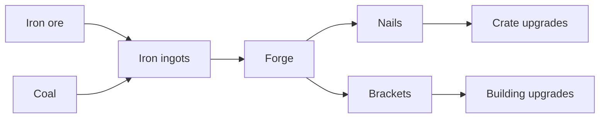

# Chain 7: Nails And Brackets

The player turns iron ingots into nails and brackets at the forge. These small
metal parts support early building upgrades, storage improvements, and later
tool repairs.

This is the first chain where Smithing produces something that is not a tool.

## Summary

| Field | Value |
| --- | --- |
| Main specialization | Smithing |
| Side specialization | Mining |
| Player stage | Early game |
| Starting resource | Iron ingots |
| Required building | Forge |
| Final product | Nails and brackets |
| First unlock time | Around 85-110 min |
| Skill requirement | Smithing 2, Mining 1 |
| First trade moment | Selling metal parts to carpenters and builders |

## Production Graph

## Progression Timing

| Time reached | Requirement | Expected player state |
| --- | --- | --- |
| 50-75 min | Forge and first ingots | Player can smelt loose ore |
| 75-100 min | Basic pickaxe | Player can gather more ore from deposits |
| 85-110 min | Nails and brackets | Player can improve buildings without large resource costs |

## Chain Stages

| Stage | Player action | Input | Output | Building | Design goal |
| --- | --- | --- | --- | --- | --- |
| 1 | Smelts iron | Iron ore + coal | Iron ingots | Forge | Uses starter metal chain |
| 2 | Makes nails | Iron ingot + coal | Nails | Forge | Small metal part |
| 3 | Makes brackets | Iron ingot + coal | Brackets | Forge | Stronger building part |
| 4 | Uses parts in upgrades | Nails / brackets + planks | Better buildings | Target building | Cross-specialization pressure |

## Recipes

| Recipe | Input | Output | Time | Building | Notes |
| --- | --- | --- | --- | --- | --- |
| Nails | 1 iron ingot + 1 coal | 8 nails | 30 s | Forge | Used in crates, workbench, mill |
| Brackets | 2 iron ingots + 1 coal | 2 brackets | 40 s | Forge | Used in stronger building upgrades |
| Repair pins | 1 iron ingot | 4 repair pins | 25 s | Forge | Feeds the repair chain later |

## Buildings And Upgrades

| Object | Type | Cost | Unlocks | Role |
| --- | --- | --- | --- | --- |
| Forge | Building | 10 stone blocks + 6 wooden logs + 4 coal | Metal parts | Smithing station |
| Small anvil | Upgrade | 2 brackets + 4 stone blocks | Faster metal parts | First forge specialization upgrade |

## Skill And Building Requirements

| Unlock | Skill | Building | Notes |
| --- | --- | --- | --- |
| Nails | Smithing 2 | Forge | First non-tool metal product |
| Brackets | Smithing 2 | Forge | Slightly more expensive support part |
| Small anvil | Smithing 3 | Forge | Optional before 2h, useful after |

## Balance Notes

- Nails should be made in batches so one ingot feels meaningful.
- Brackets should be counted as individual parts, not mass resources.
- The first 2-3h should use nails and brackets for upgrades, not basic survival.
- This chain should create the first clean reason for a carpenter to buy from a
  smith.

## Design Risks

- If nails are required too early, players may feel forced into Smithing.
- If metal parts use too many ingots, the pickaxe competes with every upgrade.
- If nails have no local value, the chain becomes only market filler.
