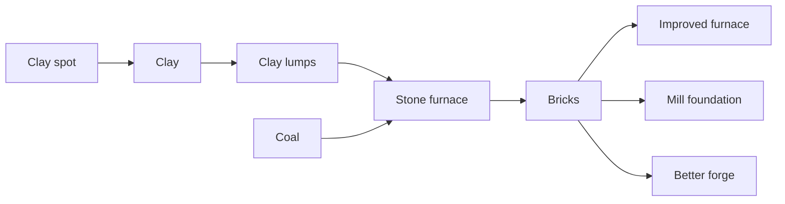

# Chain 8: Clay And Bricks

The player gathers clay from shallow clay spots, dries it into clay lumps, and
fires bricks in the stone furnace.

Bricks are the first stronger construction material. They should appear near the
end of the starter window, giving the player a clear next building goal without
requiring huge quantities.

## Summary

| Field | Value |
| --- | --- |
| Main specialization | Mining |
| Side specialization | Smithing |
| Player stage | Early game to early mid game |
| Starting resource | Clay spot on the map |
| Required building | Stone furnace |
| Final product | Bricks |
| First unlock time | Around 100-140 min |
| Skill requirement | Mining 2, Smithing 1 |
| First trade moment | Selling bricks to players upgrading production buildings |

## Production Graph

## Progression Timing

| Time reached | Requirement | Expected player state |
| --- | --- | --- |
| 30-50 min | Stone furnace | Player can process fuel |
| 75-100 min | Pickaxe and stable coal | Player can support furnace use |
| 100-140 min | Brick firing | Player sees first stronger building material |

## Chain Stages

| Stage | Player action | Input | Output | Building | Design goal |
| --- | --- | --- | --- | --- | --- |
| 1 | Gathers clay | Clay spot | Clay | None | New map resource |
| 2 | Prepares clay lumps | Clay | Clay lumps | Drying rack / manual | Shows pre-processing |
| 3 | Fires bricks | Clay lumps + coal | Bricks | Stone furnace | Stronger construction material |
| 4 | Uses bricks | Bricks + parts | Improved building | Construction site | Opens slower post-2h upgrades |

## Recipes

| Recipe | Input | Output | Time | Building | Notes |
| --- | --- | --- | --- | --- | --- |
| Clay gathering | Clay spot | Clay | Short action time | None | Limited spots near starter areas |
| Clay lumps | 3 clay | 3 clay lumps | 20 s | Drying rack / manual | Low friction pre-processing |
| Bricks | 4 clay lumps + 1 coal | 4 bricks | 45 s | Stone furnace | Stronger building material |

## Buildings And Upgrades

| Object | Type | Cost | Unlocks | Role |
| --- | --- | --- | --- | --- |
| Drying rack | Building | 4 wooden logs + 2 planks | Clay lumps | Tiny pre-processing station |
| Brick lining | Upgrade | 8 bricks + 2 brackets | Hotter furnace recipes | First furnace upgrade path |

## Skill And Building Requirements

| Unlock | Skill | Building | Notes |
| --- | --- | --- | --- |
| Clay gathering | Mining 1 | None | Can begin early but is not needed immediately |
| Drying rack | Carpentry 1 | None | Cheap support building |
| Bricks | Mining 2, Smithing 1 | Stone furnace | End of starter window |

## Balance Notes

- Early brick costs should be 4-12 bricks per upgrade.
- Bricks should unlock stronger buildings, not replace stone blocks immediately.
- The player should make a few batches, not farm thousands of clay.
- Bricks are a good first material that becomes slower after the 2h mark.

## Design Risks

- If bricks arrive too early, stone blocks lose purpose.
- If bricks require too many clay spots, the map becomes a scavenger hunt.
- If every better building needs bricks, progression becomes too narrow.
