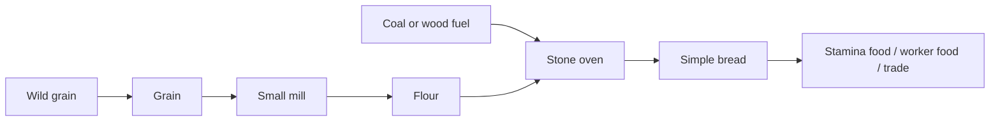

# Chain 9: Grain, Flour, And Bread

The player gathers wild grain, builds a small mill, grinds flour, and bakes
simple bread in an oven.

Food should not be a hard survival tax during the first 2-3h. Its early role is
to support stamina, worker readiness later, and trade bundles.

## Summary

| Field | Value |
| --- | --- |
| Main specialization | Farming |
| Side specialization | Carpentry |
| Player stage | Early game |
| Starting resource | Wild grain |
| Required buildings | Small mill and stone oven |
| Final product | Simple bread |
| First unlock time | Around 90-150 min |
| Skill requirement | Farming 1-2, Carpentry 1 |
| First trade moment | Selling food to players doing long gathering sessions |

## Production Graph

## Progression Timing

| Time reached | Requirement | Expected player state |
| --- | --- | --- |
| 0-60 min | Wild grain can be gathered | Player notices Farming without committing |
| 90-120 min | Small mill | Player has planks and simple components |
| 120-150 min | Stone oven and bread | Player can make useful food before workers arrive |

## Chain Stages

| Stage | Player action | Input | Output | Building | Design goal |
| --- | --- | --- | --- | --- | --- |
| 1 | Gathers wild grain | None | Grain | None | Optional Farming introduction |
| 2 | Builds a small mill | Planks + components | Small mill | Construction site | First Farming processing building |
| 3 | Grinds flour | Grain | Flour | Small mill | First food intermediate |
| 4 | Builds stone oven | Stone blocks + bricks | Stone oven | Construction site | Dedicated food building |
| 5 | Bakes bread | Flour + fuel | Simple bread | Stone oven | First food product |

## Recipes

| Recipe | Input | Output | Time | Building | Notes |
| --- | --- | --- | --- | --- | --- |
| Grain gathering | Wild grain patch | Grain | Short action time | None | Early optional resource |
| Flour | 4 grain | 2 flour | 30 s | Small mill | First mill product |
| Simple bread | 2 flour + 1 wood or coal | 2 bread | 45 s | Stone oven | Stamina or worker food |

## Buildings And Upgrades

| Object | Type | Cost | Unlocks | Role |
| --- | --- | --- | --- | --- |
| Small mill | Building | 8 planks + 2 simple components | Flour | First Farming processor |
| Stone oven | Building | 8 stone blocks + 4 bricks | Bread | First Cooking processor |
| Grain bin | Upgrade | 4 planks + 4 nails | More grain storage | Food logistics |

## Skill And Building Requirements

| Unlock | Skill | Building | Notes |
| --- | --- | --- | --- |
| Grain gathering | Farming 1 | None | Optional early skill |
| Flour | Farming 1 | Small mill | First processed food material |
| Simple bread | Farming 2 or Cooking 1 | Stone oven | Useful but not mandatory |

## Balance Notes

- Bread should be useful, not required, during the first 2-3h.
- The mill and oven should be real buildings, not inventory recipes.
- Food can be the first chain that hints at future NPC worker upkeep.
- The player should need 1-3 bread per activity burst, not constant feeding.

## Design Risks

- If food is mandatory too early, it distracts from production learning.
- If bread gives no benefit, Farming has no early hook.
- If the mill needs metal too early, Farming depends too much on Smithing.
