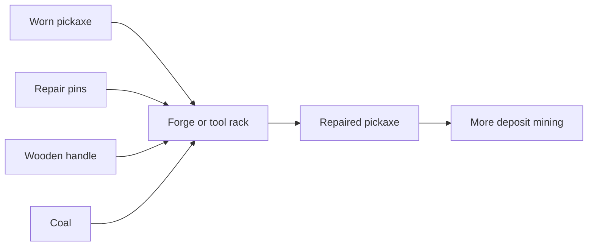

# Chain 11: Tool Repair

The player repairs worn tools at the forge or tool rack using repair pins,
handles, and small amounts of coal.

Repair makes tools feel like real crafted objects without forcing constant full
replacement. It also gives metal parts a repeat use.

## Summary

| Field | Value |
| --- | --- |
| Main specialization | Smithing |
| Side specialization | Carpentry |
| Player stage | Early game |
| Starting resource | Worn tool |
| Required building | Forge or tool rack |
| Final product | Repaired tool |
| First unlock time | Around 120-170 min |
| Skill requirement | Smithing 2, Carpentry 1 |
| First trade moment | Repair services for players who do not smith |

## Production Graph

## Progression Timing

| Time reached | Requirement | Expected player state |
| --- | --- | --- |
| 75-100 min | Basic pickaxe | Player has first tool |
| 100-130 min | Tool durability starts to matter | Player has mined enough to notice wear |
| 120-170 min | Repair loop | Player can extend tools instead of replacing them |

## Chain Stages

| Stage | Player action | Input | Output | Building | Design goal |
| --- | --- | --- | --- | --- | --- |
| 1 | Uses tool | Pickaxe durability | Worn pickaxe | Map | Creates tool lifecycle |
| 2 | Crafts repair pins | Iron ingot | Repair pins | Forge | Uses metal parts |
| 3 | Crafts handle | Wooden log | Wooden handle | Workbench / lumberjack hut | Uses wood parts |
| 4 | Repairs tool | Worn tool + parts | Repaired tool | Forge / tool rack | Avoids full recrafting |

## Recipes

| Recipe | Input | Output | Time | Building | Notes |
| --- | --- | --- | --- | --- | --- |
| Repair pins | 1 iron ingot | 4 repair pins | 25 s | Forge | From metal parts chain |
| Replacement handle | 1 wooden log | 2 wooden handles | 15 s | Simple workbench | From tool chain |
| Basic pickaxe repair | Worn pickaxe + 2 repair pins + 1 handle + 1 coal | Repaired pickaxe | 35 s | Forge / tool rack | Cheaper than a new pickaxe |

## Buildings And Upgrades

| Object | Type | Cost | Unlocks | Role |
| --- | --- | --- | --- | --- |
| Tool rack | Upgrade | 6 planks + 2 iron ingots | Tool storage and repairs | Practical forge upgrade |
| Repair vise | Upgrade | 2 brackets + 4 planks | Faster repairs | Post-starter quality-of-life |

## Skill And Building Requirements

| Unlock | Skill | Building | Notes |
| --- | --- | --- | --- |
| Repair pins | Smithing 2 | Forge | Same stage as nails |
| Replacement handle | Carpentry 1 | Workbench | Cheap support part |
| Basic repair | Smithing 2 | Forge or tool rack | Starts after first tool wear |

## Balance Notes

- Repair should cost less than full replacement.
- Repairs should preserve the feeling that tools are valuable single items.
- The first tool should not break before the player has learned repairs.
- Repair services can become a player-to-player service later.

## Design Risks

- If durability is too punishing, repair feels like upkeep tax.
- If repairs are too cheap, tool sales die.
- If repairs need rare materials, players may prefer to discard tools.
