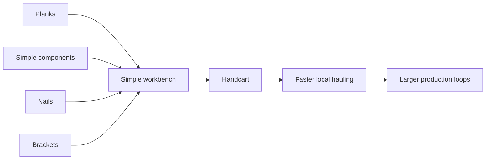

# Chain 12: Handcart And Transport

The player crafts a small handcart using planks, simple components, and metal
parts. The handcart increases short-range transport between gathering points,
storage, and production buildings.

This chain introduces logistics as a production problem before advanced workers
or automated routes exist.

## Summary

| Field | Value |
| --- | --- |
| Main specialization | Carpentry |
| Side specialization | Smithing and Trading |
| Player stage | Early game to early mid game |
| Starting resource | Planks and metal parts |
| Required building | Simple workbench |
| Final product | Handcart |
| First unlock time | Around 140-180 min |
| Skill requirement | Carpentry 2, Smithing 2 or bought metal parts |
| First trade moment | Selling handcarts to production-focused players |

## Production Graph

## Progression Timing

| Time reached | Requirement | Expected player state |
| --- | --- | --- |
| 45-60 min | Simple components | Player can craft basic parts |
| 85-110 min | Nails and brackets | Player can make or buy metal parts |
| 140-180 min | Handcart | Player has enough loops that transport matters |

## Chain Stages

| Stage | Player action | Input | Output | Building | Design goal |
| --- | --- | --- | --- | --- | --- |
| 1 | Crafts components | Planks | Simple components | Simple workbench | Uses Carpentry chain |
| 2 | Crafts metal parts | Ingots + coal | Nails and brackets | Forge | Uses Smithing chain |
| 3 | Assembles handcart | Planks + parts | Handcart | Simple workbench | First logistics equipment |
| 4 | Uses handcart | Player time | Faster hauling | City / map | Makes layout matter |

## Recipes

| Recipe | Input | Output | Time | Building | Notes |
| --- | --- | --- | --- | --- | --- |
| Cart frame | 6 planks + 2 simple components | 1 cart frame | 45 s | Simple workbench | Main wooden part |
| Cart fittings | 4 nails + 2 brackets | 1 fitting set | 35 s | Forge | Metal support part |
| Handcart | 1 cart frame + 1 fitting set + 2 planks | 1 handcart | 60 s | Simple workbench | First transport item |

## Buildings And Upgrades

| Object | Type | Cost | Unlocks | Role |
| --- | --- | --- | --- | --- |
| Handcart | Equipment / placeable | Frame + fittings + planks | Manual transport boost | Early logistics item |
| Cart bay | Upgrade | 8 planks + 4 brackets | Handcart storage | Optional logistics upgrade |

## Skill And Building Requirements

| Unlock | Skill | Building | Notes |
| --- | --- | --- | --- |
| Cart frame | Carpentry 2 | Simple workbench | Uses wood parts |
| Cart fittings | Smithing 2 | Forge | Can be bought if player avoids Smithing |
| Handcart | Carpentry 2 | Simple workbench | End of starter logistics path |

## Balance Notes

- The handcart should be a single meaningful object.
- It should reduce walking friction, not become mandatory for basic gathering.
- It is a good first item where buying from another player may be easier.
- It naturally leads into warehouses, worker routes, and transport contracts.

## Design Risks

- If the handcart is too strong, early inventory limits become irrelevant.
- If it is too weak, logistics does not feel like a real production layer.
- If it requires too many metal parts, it arrives too late to teach logistics.
